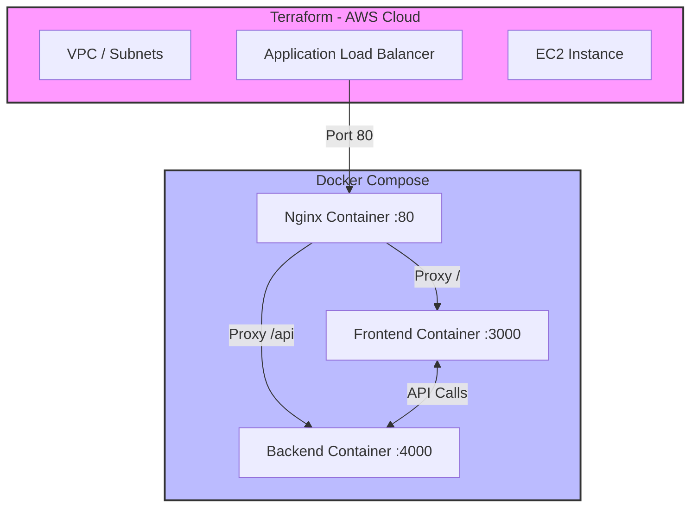
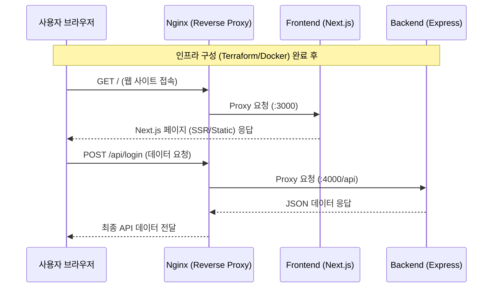

# project

이 프로젝트는 Next.js 개인 연습용 공간입니다

```bash
# 빌드
docker compose up --build
# 빌드된 이미지 사용
docker compose up
# 빌드된 이미지 remove
docker compose down
```

차트




## 배포  테스트 확인 순서
```
# awsconfig설정을 마친뒤에 아래명령어를 입력해주세요
# 사전에 chomod 400 으로 키페어 파일 권한을 (1회 해주세요)

terraform init --upgrade  // terraform.lock.hcl 파일에서 이 도구를 쓸거라고 해줘야함  (동기화/ 1회만)
terraform apply           // awsconfig에 aws사용자에 인스턴스/vpc/보안그룹/swap/docker설치 자동화
```
```
# 설치후 ssh로 접속후 아래명령어로 swap이 잘되었는지확인 (2GB)
ssh -i "키페어파일위치" ec2-user@<여러분의-EC2-공인-IP>
free -h                           //  swap  항목에 2.0Gi라고 나오면  성공!
docker ps 또는 docker --version    //  sudo 없이 실행 가능하다면 성공 (테라폼 코드를 확인해주세요 유저 그룹에 세팅을 해놓았습니다.)
```
```
# Docker Compose 설치 (현재:  Amazon  Linux 2023 용입니다.)
mkdir -p ~/.docker/cli-plugins/
curl -SL https://github.com/docker/compose/releases/latest/download/docker-compose-linux-x86_64 -o ~/.docker/cli-plugins/docker-compose
chmod +x ~/.docker/cli-plugins/docker-compose
// 확인: docker compose version
```
```
# Nginx 설치 및 실행
sudo dnf install -y nginx
sudo systemctl start nginx
sudo systemctl enable nginx

sudo vi /etc/nginx/conf.d/default.conf
```
```
### /etc/nginx/conf.d/default.conf
server {
    listen 80;
    server_name localhost;

    location / {
        # 초기에는 3000번 포트를 바라보게 설정합니다.
        # 나중에 배포 스크립트가 이 부분을 3001로 바꿀 것입니다.
        proxy_pass http://localhost:3000;
        proxy_set_header Host $host;
        proxy_set_header X-Real-IP $remote_addr;
        proxy_set_header X-Forwarded-For $proxy_add_x_forwarded_for;
    }

    # 앱에서 만든 헬스체크 경로가 있다면 확인하세요
    location /health {
        proxy_pass http://localhost:3000/health;
    }
}

// 저장후 sudo nginx -t 로 문법검사에서 이상점이 없는지 확인
// 이상이 없다면 sudo systemctl restart nginx
```
```
terraform destory         // 테스트가 다끝나면 aws에 인스턴스를 치워줍니다.
```