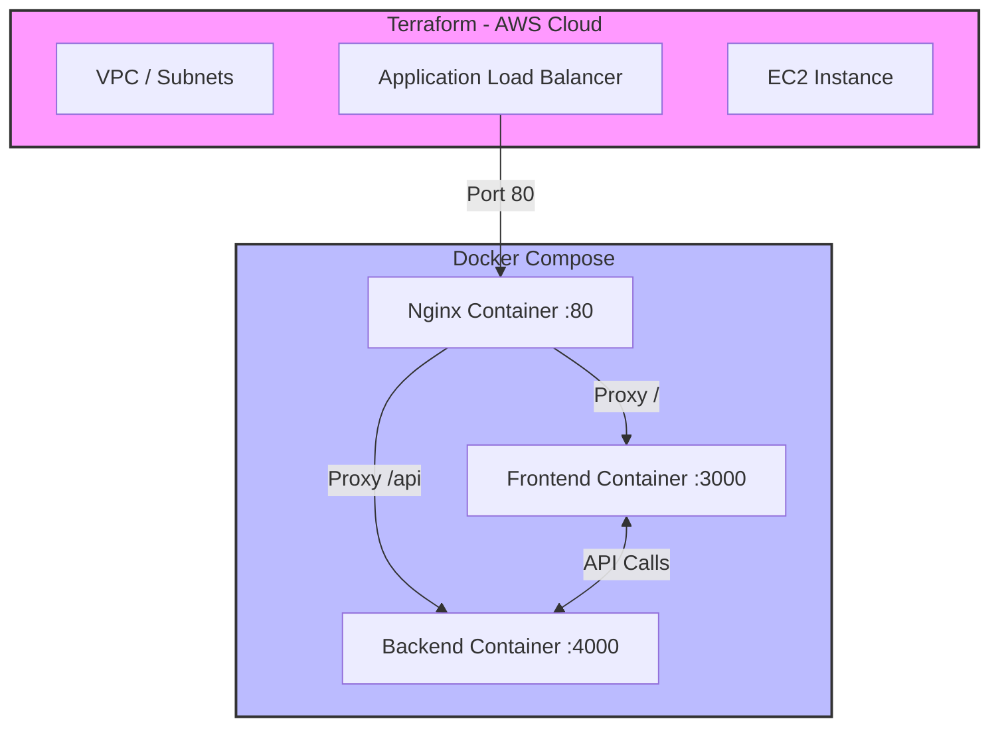
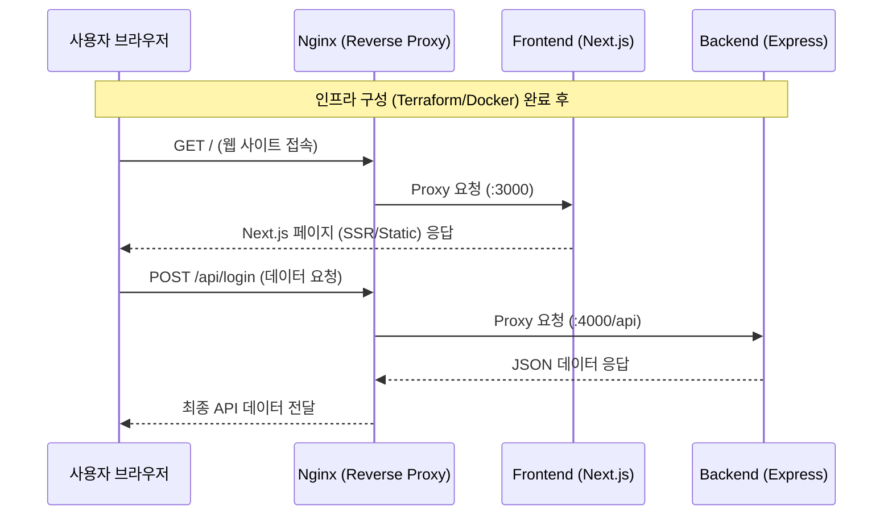

# project

이 프로젝트는 Next.js 개인 연습용 공간입니다

## first-devops-test (fe-be)
```bash
# 빌드
docker compose up --build
# 빌드된 이미지 사용
docker compose up
# 빌드된 이미지 remove
docker compose down
```
차트

```mermaid
graph TD
    subgraph Infrastructure_Layer [Terraform - AWS Cloud]
        VPC[VPC / Subnets]
        ALB[Application Load Balancer]
        EC2[EC2 Instance]
    end

    subgraph Container_Layer [Docker Compose]
        NGINX[Nginx Container :80]
        FE[Frontend Container :3000]
        BE[Backend Container :4000]
    end

    %% Infrastructure to Container
    ALB -->|Port 80| NGINX

    %% Nginx Routing
    NGINX -->|Proxy /| FE
    NGINX -->|Proxy /api| BE

    %% App Communication
    FE <-->|API Calls| BE
    
    style Infrastructure_Layer fill:#f9f,stroke:#333,stroke-width:2px
    style Container_Layer fill:#bbf,stroke:#333,stroke-width:2px
```


```mermaid
sequenceDiagram
    participant User as 사용자 브라우저
    participant Nginx as Nginx (Reverse Proxy)
    participant FE as Frontend (Next.js)
    participant BE as Backend (Express)

    Note over User, BE: 인프라 구성 (Terraform/Docker) 완료 후

    User->>Nginx: GET / (웹 사이트 접속)
    Nginx->>FE: Proxy 요청 (:3000)
    FE-->>User: Next.js 페이지 (SSR/Static) 응답

    User->>Nginx: POST /api/login (데이터 요청)
    Nginx->>BE: Proxy 요청 (:4000/api)
    BE-->>Nginx: JSON 데이터 응답
    Nginx-->>User: 최종 API 데이터 전달
```
